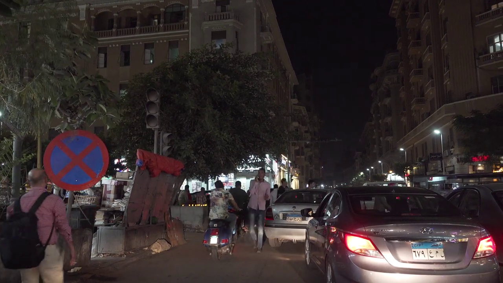
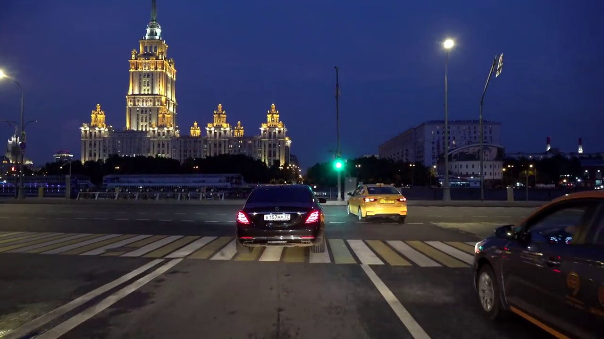
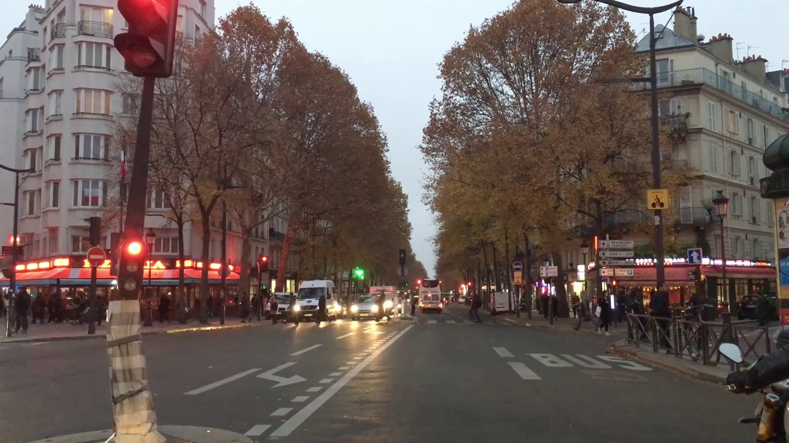

# Location Determination

The Kaggle dataset [where am i](https://www.kaggle.com/datasets/ahmedhaytham/where-am-i) was created by Ahmed Haytham and Shady Nagy as an assignment during their internship at Curve-AI. They were tasked with building an image dataset from 3 youtube videos showing a car driving in 3 diffierent cities (Cairo, Paris, Moscow) and training an image classifier to predict the city from an image.

For the capstone, I used this dataset to build and deploy an image classifier. Here are 3 sample images from the dataset:

I took the following approach:

1- Building phase: Use transfer learning to build 3 image classifiers on top of 3 architectures, Xception, Inception, and ResNet
2- Training phase: Train 3 classifiers and tune their hyperparameters
3- Deployment phase: Deploy the best performing classifier

**Building Phase**

Central to this approach is the args namespace. I created 3 namespaces, one for each classifier, to save the hyperparameter values.

The 3 namespaces are then combined in a global namespace that also includes other parameters and flags that I use throughout the training process.

For each architecture I created a class that instantiates a vanilla classifier, using the `build_model` class function. It is also possible to add an extra layer and adjust the dropout rate of the classifier by passing the right parameters to the function call.

I created a custom callback that logs the performance of the model with different parameters and saves them in a dictionary after each epoch, which I appended to a scores dictionary. I used this scores dictionary for 2 things:
1- To generate performance plots
2- To save the best parameter for each architecture.

**Training Phase**

In the training I started by tuning the learning rate for all 3 classifiers. Once I learned the best lr for each architecture, I moved on to adding an extra layer for to the 3 architectures, and adjusting the droprate. 

Afterwards, I used the best hyperparameters for each architecture and used them to train 3 classifiers on augmented images. 

Finally, I trained the top 2 classifiers from the previous step using a larger input size (299 instead of 150), and decide which model to deploy.

**Deployment Phase**

I deployed the code using flask, and built 2 containers one to provision the model and another to provision the preprocessing code. I used docker-compose to connect the containers.

To run the docker image use this command:

`docker-compose up`

To test the app, run the following command in a separate terminal:

`python predict-test.py`