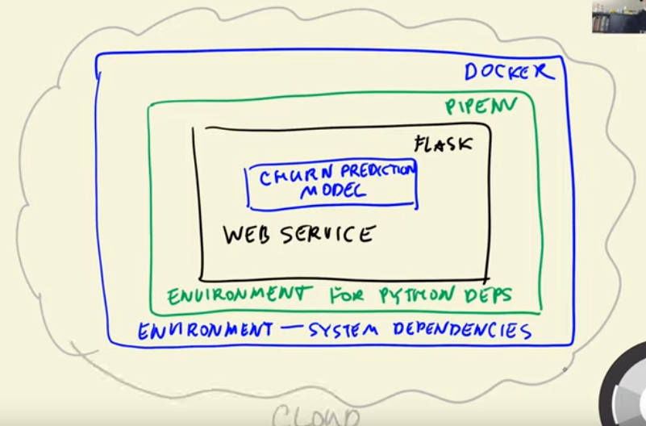

In week 5️⃣ of the ML Zoomcamp we covered:

💾🔄🥒 Saving + Loading a model with Pickle
We learn how to save and load a model created in a Jupytor notebook into a serializable file using Pickle, and how to use this model to make predictions. The steps for converting the model into a webservice are:
1- Save the model to a Pickle file
2- Use Flask framework to create a webservice
3- Create a virtual environment to isolate the dependencies of our webservice
4- Use Docker to containerize system dependecies 
5- Deploy the webservice into the cloud

🚀🌐💻 Create a production ready webservice application using Flask + Gunicorn 
We learn about webservices and how Flask abstracts network calls such as GET and POST. We create a simple Flask app and how to use Python decorators to add GET / POST functionality to it. We also create an Flask app for our model so it can be used as a webservice. Finally, we deploy the prediction app using gunicorn

🏠🐳📦 Build a Docker container to host the app and system dependcies 
We use Python's virtual enviornment to isolate our package's dependcies. We install all the libraries that we use in the app using the pipenv install command which creates a Pipfile that saves the installed package and versions. We then create a docker image to load + run the dependcies stored in the Pipfile, load the saved model, and expose a port so we can communicate with the webservice

🐳📦☁️ Deploy the Docker container to the cloud using AWS Elastic Beanstalk
We install the AWS EB cli, run EB locally, deploy the model as a cloud webservice, and test it. This makes our service scalable and accessible

Our homework involved:  

* Installing pipenv and using it to install a specific scikit-learn version
* Loading a credit prediction model from a pickle file and using it to make prediction
* Creating a flask app for our model 
* Creating a docker container to host our flask app

#mlzoomcamp #ml_engineering #data_science #learning_in_public 

The code for homework 5 can be found [here](https://github.com/el-grudge/mleng-zoomcamp/tree/main/week_5). 

